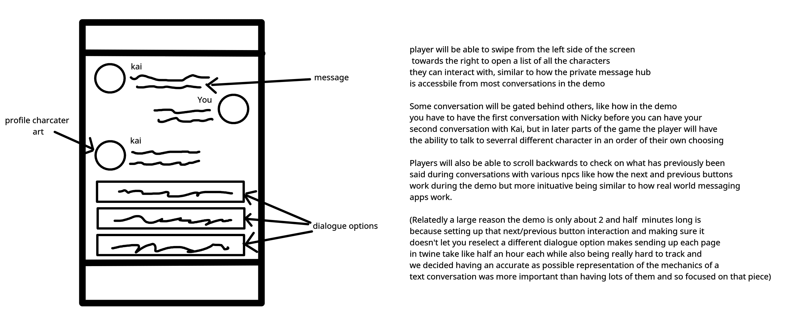

# Reflections

Reflections is the Social Impact Games INFR 3370U Course at Ontario Tech University Fall 2021 Final Project Low Fidelty prototype made by Atlas X Games
Ame Gilham - 100741352
Jackie Zhou - 100750922
Jeffrey Lundy - 100745949

It features an approximately 2 and a half minute text based demo of some of the basic dialogue and some text based approxiation of the mechanics associated with messaging people.
This demo is playable at the following link: https://luminousame.github.io/Reflections/ 

In additional this prototype also features the following Ui mockup

The justifcation report will be submitted seperately as a pdf. 

Thank you for reading!
- Atlas X Games.
